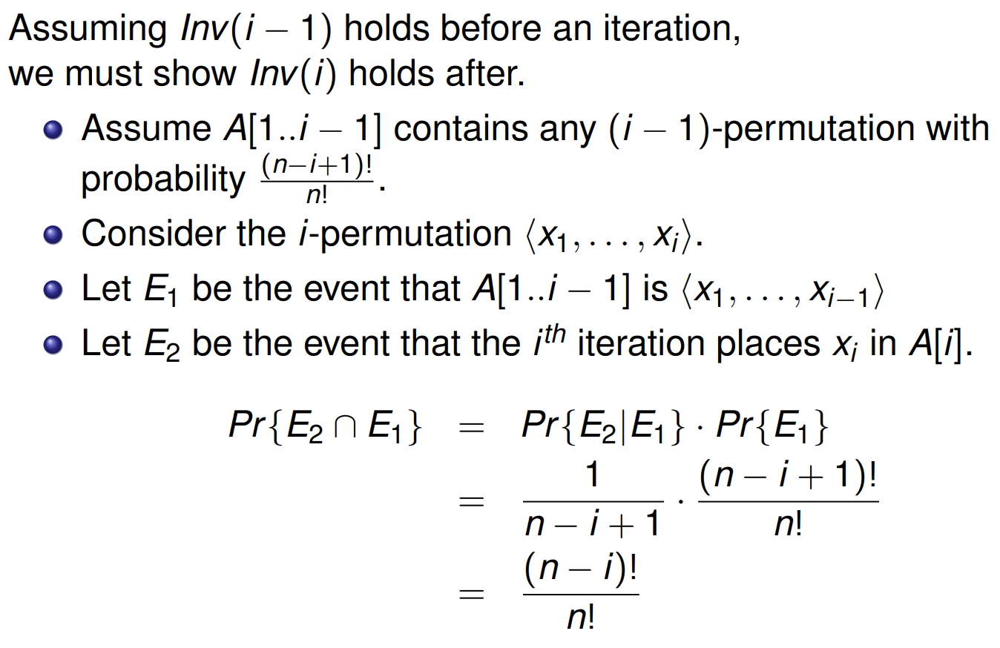
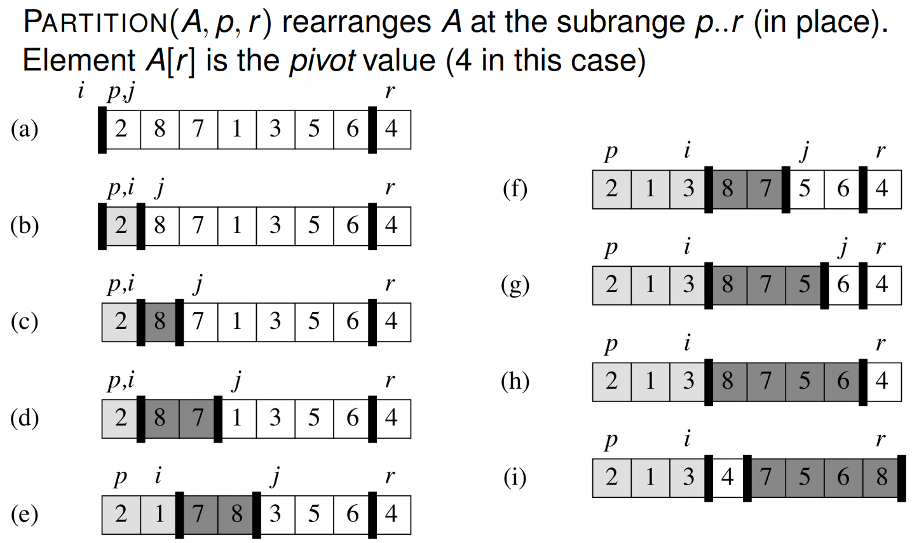

# Lecture 10 &mdash; Randomised Algorithms

We will talk about probabilistic analysis and randomised algorithms, with a focus on quicksort.

## Average case analysis

Although we focus on worst-case complexities, there are also best case and average cases. The average case is the sum of each possible running time weighted by its probability.
$$
\begin{aligned}
T_{\text{worst}}(n) &= \max_{|x|=n}T(n) \\ 
T_{\text{best}}(n) &= \min_{|x|=n}T(n) \\ 
T_{\text{average}}(n) &= \sum_{|x|=n}T(x)P(x)\\ 
\end{aligned}
$$

### Hire assistant

Consider an algorithm which needs to hire candidates from a list and performs a hire when the current candidate is better than the current hire. In pseudocode,

```python
def hire_assistant(n):
    best = 0
    for j in range(n):
        interview(candidate[j]) # cost c_i
        if candidate[j] > best:
            best = j
            hire(candidate[j])  # cost c_h
```

Let $n$ be the total number of candidates and $m$ be the number of hires made. The actual cost is $nc_i + mc_h$ and the worst case is if we hire everyone so $n=m$ and the cost is $n(c_i+c_h)$. What is the average case?

We need to consider the probability of hiring the $j$-th candidate. Assume the candidates are in random order and so any of the first $j$ candidates are equally likely to be the best. The probability the $j$-th candidate is the best of the first $j$ candidates is $1/j$. 

Thus, the average cost of hiring candidates is
$$
c_h\sum_{j=1}^n \frac 1 j = c_h \ln n + O(1)
$$
which is much better than the worst-case of $n c_h$.

## Randomised algorithms

The algorithm above is a deterministic algorithm. 

A **randomised algorithm** is one where its behaviour is determined by both its inputs and some random number generator.

- For deterministic algorithms, we can calculate an average running time from the distribution of inputs.
- For non-deterministic (randomised) algorithms, we need to calculate the _expected_ running time without being to make an assumption on the probability distribution of the inputs.

### Randomly permuting arrays

How can we randomise the hire assistant algorithm? We want a uniform random permutation, so a $1/n!$ chance for each permutation of the $n$ elements in $A$. 

A simple way to do this is the algorithm below. 

```python
def permute_by_sort(A):
    n = len(A)
    P = [0] * n
    for i in range(n):
        P[i] = randint(1, n**3)
    # sort A using P as the keys
```

This produces a unique random permutation, so long as the chosen keys are unique. The probability of keys being unique is
$$
\frac {n^3}{n^3} \times \frac{n^3-1}{n^3} \times \frac{n^3 - 2}{n^3}\times \cdots \times \frac{n^3-n}{n^3} \ge \left( 1 - \frac 1 {n^2} \right)^n \ge 1 - \frac 1 n.
$$
This is reasonably non-zero so is not good enough. In fact, this gets closer to $1$ as $n$ becomes large.

Alternatively, we can permute it by randomising in-place.

```python
def randomise_in_place(A):
    n = len(A)
    for i in range(n):
        # randomly swap i with an element to the right
        swap(A[i], A[randint(i, n)]) 
```

A $k$-permutation of a set of $n$ elements is a sequence containing $k$ of the $n$ elements. The invariant at $i$ is that $A[1..i]$ contains any $i$-permutation of $A$ with probability $(n-i)!/n!$. Before the first element, $A[1..0]$ contains a $0$-permutation with probability $1$ (trivially).

Assume that the invariant holds at $i-1$. We must show that the invariant holds at $i$. 



At the termination of the algorithm, $A[1..n]$ will contain any $n$-permutation with probability
$$
\frac{(n-n)!}{n!}=\frac 1 {n!},
$$
so each of the $1/n!$ possible permutations is equally likely.

## Quicksort

Quicksort is great because it's "pretty fast" "most of the time". It preprocesses the array into partitions based of less than or greater than some pivot value. In pseudocode:

```python
def quicksort(A, p, r):
    if p < r:
        q = partition(A, p, r)
        quicksort(A, p, q-1)
        quicksort(A, q+1, r)
```

In contrast, mergesort postprocesses sorted subarrays into a larger sorted array.

The algorithms are very similar but differ in how they work with the recursive calls.

A visual representation of the partition algorithm is below. 



The performance of quicksort depends very much on the element chosen as the pivot. The best and average cases are $\Theta(n \log n)$ but the worst case is terrible at $\Theta(n^2)$. With the partitioning scheme above, the worst case occurs if the array is already sorted or reverse sorted. This is actually where insertion sort has its best case.

How can we do this average case analysis? Later on, how can we randomise it so we get expected time complexity of $n \log n$ always?

There are some cases with different performance:
$$
\begin{aligned}
q=\left\lfloor\frac{p+q}2\right\rfloor &\implies T(n) = 2T(n/2) + \Theta(n) & \in \Theta(n \log n) \\ 
q=p+\frac{r-p}c &\implies T(n) = T(n/c) + T((c-1)n/c) + \Theta(n) &\in \Theta(n \log n) \\ 
q=p &\implies T(n) = T(n-1) + T(0) + \Theta(n) &\in \Theta(n^2)
\end{aligned}
$$
Interestingly, when there is a proportional split as in the second case, the running time is still (asymptotically) optimal.

### Analysis of quicksort

We assume that each permutation is equally likely. We need to consider the total number of comparisons done by partition over _all_ recursive calls of quicksort. Label the elements of $A$ as $z_1, \ldots, z_n$ in sorted order. Let $Z_{ij}$ be the $i$-th to $j$-th elements in sorted order.

Consider an array of $1..10$ in any order and assume the first pivot is 4. The array would be partitioned into $\{1, 2, 3\}$ and $\{5, 6, 7, 8, 9, 10\}$. In the partitioning, we compare 4 to every other element. At this point, nothing in the left set will ever be compared to an element of the right set.

For any elements $z_i$ and $z_j$, once a pivot $x$ is chosen such that $z_i < x < z_j$, then $z_i$ will never be compared to $z_j$ in the future.

If $z_i$ is chosen as a pivot before an other element in $Z_{ij}$, it will be compared to every other element in $Z_{ij}$. Similarly for $z_j$. This, $z_i$ and $z_j$ are compared if and only if the first element chosen as pivot from $Z_{ij}$ is either $z_i$ or $z_j$. Any element in $Z_{ij}$ is equally likely and $Z_{ij}$ has $j-i+1$ equally likely elements.

Each pair of elements is compared at most once because in partition, elements are compared with the pivot only at most once, and an element is only used as a pivot in at most one partition step.
$$
\begin{aligned}
P(z_i \text{ compared to }z_j)&=P(z_i\text{ or }z_j \text{ is first pivot chosen from } Z_{ij}) \\ 
&= \frac {1}{j-i+1} + \frac {1}{j-i+1} \\ 
&= \frac {2}{j-i+1}
\end{aligned}
$$
Now, we just need to sum over all pairs of possible comparisons. Then,
$$
\begin{aligned}
\sum_{i=1}^{n-1}\sum_{j=i+1}^nP(z_i \text{ compared to }z_j)  
&= \sum_{i=1}^{n-1}\sum_{j=i+1}^n\frac 2 {j-i+1} \\ 
&= \sum_{i=1}^{n-1}\sum_{k=1}^{n-i}\frac 2 {k+1} \\ 
&<  \sum_{i=1}^{n-1}\sum_{k=1}^{n}\frac 2 {k} \\ 
&\in \sum_{i=1}^{n-1}O(\log n) \in O(n \log n)
\end{aligned}
$$
This is assuming the inputs are evenly distributed, but this is not likely in practice. Usually, we will get given arrays which are almost sorted.

We can randomise it which ensures that the input arrays are all evenly distributed by randomly permuting the array before sorting it. Random permuting can be done in $\Theta(n)$. In fact, we don't even need to permute the entire array. We can just randomly choose a pivot from a random location.

Either method will give us **expected running time** of $\Theta(n \log n)$ and the worst case will be unlikely.

## Biased random

In random algorithms, we typically assume we have access to some fair coin via RNG. In practice, we may not have a fair coin. We might have a biased coin with probability $p \ne 1/2$. If all we have is a biased coin, how can we implement a fair coin which returns 0 or 1 with equal probability?

Suppose we flip the coin twice. The probability of both 0 is $p^2$. The probability of 0 then 1 or 1 then 0 is $p(1-p)$ and the probability of both 1 is $(1-p)^2$. Then, the probability that $a=0$ _given_ $a \ne b$ is $1/2$.

We can continue until we get 0 and 1 or 1 and 0, returning an arbitrary one when they differ.

```python
def random():
    a = biased_random()
    b = biased_random()
    while a == b:
        a = biased_random()
        b = biased_random()
    return a
```

The running time depends on $p$ and we have _almost certain_ termination.

Let $\alpha=2p(1-p)$ be the probability that $a \ne b$. The probability of terminating after $0$ iterations is just $\alpha$. After once, it is $\alpha(1-\alpha)$. Continuing, the probability of terminating after exactly $i$ iterations is
$$
(1-\alpha)^i\alpha.
$$
The expected number of iterations is the sum of $i$ multiplied by the probability of each,
$$
\begin{aligned}
\sum_{i=0}^\infty i ((1-\alpha)^i\alpha) &= \alpha \sum_{i=0}^\infty i (1-\alpha)^i \\ 
&= \frac \alpha{(1-(1-\alpha))^2} \\ 
&= \frac \alpha{\alpha^2} = \frac 1 \alpha
\end{aligned}
$$
This directly gives us the expected running time.