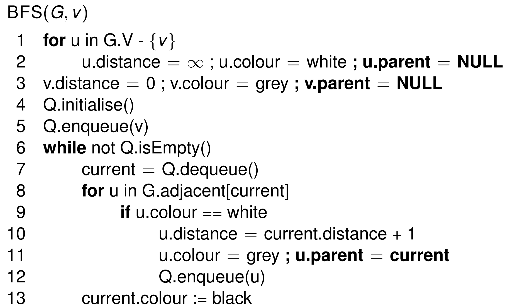
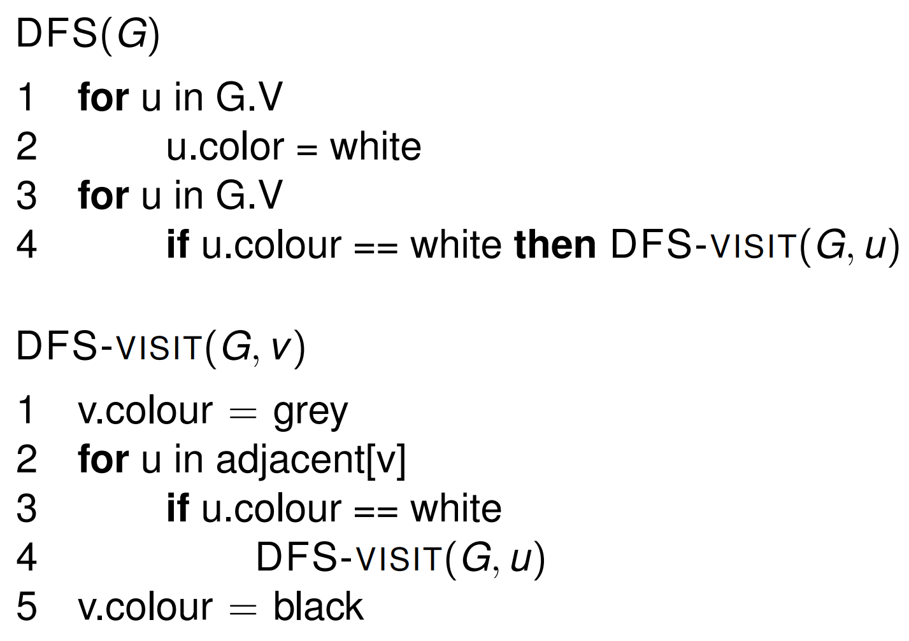

# Lecture 11 &mdash; Revision

The goal of this course has been to analyse, critique, design, and implement advanced data structures and algorithms. When faced with a problem, how can we convert it to a solvable problem in an efficient way?

Questions will require some amount of thinking and analysing instead of directly application.

## Topics

- Measuring and comparing efficiency
- Representing problems as graphs
- Dynamic programming
- Greedy algorithms
- Probabilistic analysis and randomised algorithms

We also learned about complexity classes, so we can

- understand the limits of our knowledge (P vs NP), and
- know types of problems which may not have an efficient solution.

## Exam

The exam will be **2 hours + 30 minutes**, with the 30 minutes for preparing and uploading the exam document. Some general directions are:

- Answer all questions.
- 100 marks.
- Worth 50% or 60%, whichever results in the higher final result.
- Open book.

- **5 questions.**
- Available for 2 hours from 4pm.

There is a penalty for late submissions of 20% for 1 to 15 minutes late, 50% for up to 30 minutes, and 100% for more than 30 minutes late. The penalty is applied on the marks received, not on the total available marks.

## Strategy

- Start with easiest questions (it should be easier than the midsem).
- Don't waste time searching online for answers.
- **Read answers carefully and be comprehensive with answers.**
- Even if you do not know the answers, *try*.
- Nothing written is useless.
- Exam is designed to test problem solving. Do not share answers.

## Reference sheet

### Geometric series

$$
\begin{aligned}
\sum_{i=0}^{n-1} r^i =\sum_{i=1}^{n}r^{i-1}&= \frac{1-r^n}{1-r} \\ 
\sum_{i=1}^{n}ir^{i-1}&=\frac{(n+1)r^n}{1-r}
\end{aligned}
$$

### Arithmetic series

$$
\sum_{i=0}^n i =\frac{n(n+1)}2 
$$

### Breadth-first search (BFS)

See Lecture 3.

### Depth-first search (DFS)

See Lecture 3.

