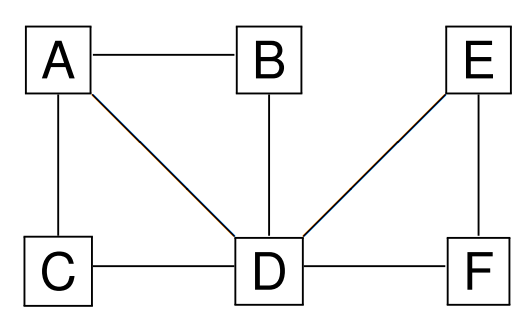

# Lecture 3 &mdash; Graphs

A **graph** is made up of *vertices* and *edges* between pairs of vertices.

Graphs can be used to represent a range of scenarios, including maps, networks, brains, and program control flow.

A graph can be directed or undirected.

## Undirected graph

- No self-loops.
- $(u, v) \in E(G)$ means $v$ is **adjacent** to $u$ and this is symmetric.
- We also say $(u, v)$ is **incident** **on** $v$ and $u$.
- The **degree** of a vertex is the number of adjacent edges.

## Directed graph

- Can have self-loops.
- $(u, v) \in E(G)$ means $v$ is **adjacent** to $u$ and this is not symmetric.
- We also say $(u, v)$ is **incident from** $u$ and **incident to** $v$.
- The **out-degree** is the number of edges leaving it.
- The **in-degree** is the number of edges entering it.
- The **degree** is the sum of in- and out-degrees.

Note that the maximum edges in a directed graph is $n^2$, and $n(n-1)/2$ for an undirected graph.

## Weights

Another key property of graphs is weights. An edge (directed or undirected) can have weights. This can represent something like distance, similarity, or cost. In a social media friends network, this might be the number of mutual friends.

## Terminology

A graph $G$ is:

- A **path** of length $k$ from $v_0$ to $v_k$ is a sequence $\langle v_0, \ldots, v_k\rangle$ such that $(v_{i-1}, v_i) \in E$ for $i=1, \ldots, k$.
- $u$ is **reachable** from $v$ if there is any path from $v$ to $u$.
- A path is **simple** if all vertices in the path are distinct.
- A path is a **cycle** if $v_0=v_k$ and $k>1$ (i.e. not a self-loop).
- A cycle is **simple** if it is distinct except for its ends.
- A graph with no simple cycles is called **acyclic**.

An undirected graph $G$ is

- **connected** if every vertex is reachable from any other,
- a **forest** if it is acyclic, and
- a **tree** if it is a forest with only one connected component.

Note that for an undirected graph with $n$ vertices, a tree must have $n-1$ edges, and a forest can have $0$ to $n-1$ vertices. In a connected undirected graph, the minimum edges is $n-1$ and the maximum is $n(n-1)/2$ because we must have connections and the maximum is an arithmetic series.

A directed graph $G$ is

- **strongly connected** if any two vertices are reachable from each other.

A graph $G'=(V', E')$ is 

- a **subgraph** of $G=(V,E)$ if $V' \subseteq V$ and $E'\subseteq E$, and
- a **spanning subgraph** if it is a subgraph and $V'=V$.

The subgraph of $G$ which is **induced by $V'$** is $G'=(V', E')$ where $E'=\{(u, v) \in E : u \in V' \wedge v \in V'\}$. That is, it has all edges which start and end in $V'$.

## Types of graphs

- Directed acyclic graph (DAG)
- Connected graph
- Trees
- Lists can also be seen as simple graphs (see linked lists)

## Representations

There are two main ways to represent graphs while programming:

- adjacency lists, and
- adjacency matrices.

Representing the sets of vertices and edges directly is often inefficient.

### Adjacency list

For undirected graphs, 

- the worst-case space complexity is $\Theta(v + \sum_{v}\operatorname{degree}(v))=\Theta(v+2e) \in \Theta(v+e)$,
- the time complexity of $\operatorname*{isAdjacentTo}(u, v)$ is $\Theta(v)$, and
- the time complexity of listing all adjacent vertex pairs is $\Theta(v+e)$.

Similarly for directed graphs,

- the space complexity is $\Theta(v+e)$, 
- the time complexity if $\operatorname*{isAdjacentTo}$ is $\Theta(v)$, and
- listing adjacent vertex pairs is $\Theta(v+e)$.

However, in this case, the bounds make use of $\operatorname*{outDegree}$ instead of just $\operatorname*{degree}$ in the derivation.

### Adjacency matrix

An adjacency matrix is a $v \times v$ matrix where the $i,j$-th entry indicates if there is an edge from $i$ to $j$.

For undirected graphs, the matrix will be symmetric, and

- the space complexity is $\Theta(v^2)$, 
- the time complexity of $\operatorname*{isAdjacentTo}$ is $\Theta(1)$ (because we only check the specific cell), and
- the time complexity of listing all adjacent vertex pairs is $\Theta(v^2)$.

Note that the optimal representation depends very much on the type of operations we expect to do and the properties of the graphs.

For a directed graph, the complexities are the same but the matrix may be asymmetric.

### Comparison of adjacency list and adjacency matrix

The adjacency list is often more efficient if the graph is sparse, and matrix is better if the graph is dense.

## Graph traversal algorithms

For an unweighted graph $G$,

- the **length of a path** is the number of edges in that path,
- the **distance** from $u$ to $v$ is the shortest path length from $u$ to $v$.

### Breadth-first search

**Breadth-first search** (BFS) takes an unweighted graph and a start vertex $v_0$. It traverses vertices within $G$ in order of their distance from $v_0$. It is able to find the shortest path from $v_0$ to every other vertex in the graph.

#### Implementation

This can be implemented using a queue (FIFO) data structure, which has operations enqueue and dequeue.

We augment the vertex type with distance, state, and parent fields. The parent fields will be used to obtain the shortest path.

### Depth-first search

Depth-first search (DFS) does not find the shortest path, but is often used as a subroutine in other algorithms. 

It visits a vertex $v$ then visiting all unvisited adjacent vertices $u$ to $v$.

It has complexity $\Theta(v) + (\sum_{v}(\Theta(1) + \operatorname*{outDegree}(v)\Theta(1)))=\Theta(v+e)$.

## Topological sort

To implement topological sort, we can DFS and add vertices to the end of the list when it has no further unvisited neighbours.