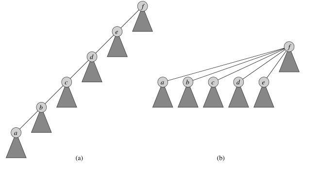
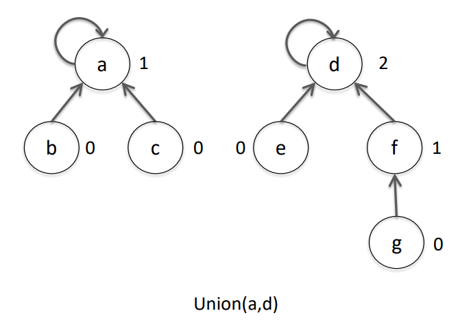
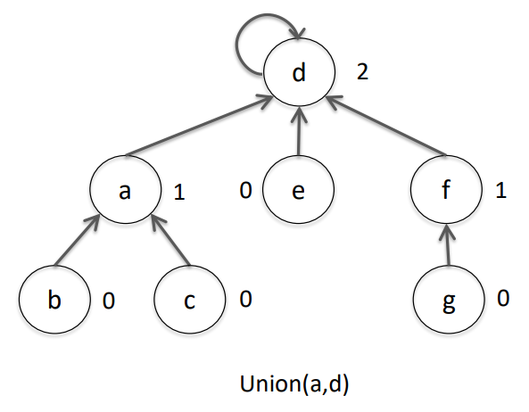

# Lecture 4 &mdash; Graphs 2

> The midsemester exam will be on 15th September.

Recall graphs are used to represent a great many problems. They may be directed/undirected and weighted/unweighted. 

They can be represented (most commonly) by an adjacency list or an adjacency matrix.

Two search methods are BFS and DFS. BFS is able to find shortest distances from a graph. DFS can be used as a subroutine.

## Minimum Spanning Tree

Suppose you are laying cable and want to connect some houses using the least amount of cable possible. This is exactly a minimum spanning tree problem.

Suppose we have a connected, undirected, weighted graph $G=(V, E)$ and weights $w(u, v)$ denoting the weight between $u$ and $v$. We want to find an acyclic subset $T \subseteq E$ such that

- all vertices in $G$ are connected, and
- the total weight of $T$, $\sum w(u, v)$ is minimised.

Specifically, $T$ is a **tree** (a connected acyclic subgraph of $G$) that **spans** (contains all vertices in $G$) and **minimises** the sum of edge weights.

## Generic Constructive Algorithm

Start with an empty set for $T$ and while $T$ is not a spanning tree, find an edge which can be added to $T$ (i.e. does not create any cycles) and add it. 

## Prim's Algorithm

Here, $T$ is always a tree. Start at any vertex (this will be our initial $T$). Repeatedly add the least-weight edge leaving the constructed tree $T$. For each edge leaving the adjacent vertex, we update that in a priority queue. The algorithm stops when $T$ is a spanning tree, i.e. contains every vertex from $G$.

How can we find the least-weight edge leaving $T$? 

- Maintain a priority queue $Q$ containing vertices $V-T$. For each vertex in this queue, its key is the minimum edge weight connecting it to $T$. Additionally, its parent is the vertex adjacent along this least-weight edge.
- Recall that a priority queue's operations are insert, extractMin, and decreaseKey.

## Kruskal's Algorithm

Also used to find a minimum spanning tree. Here, $T$ is always a spanning acyclic subgraph, a *forest* of trees. Initially, $T$ is all vertices but no edges.

At each step, the least-weight edge connecting two trees in $T$ is added to the forest. We repeat this process until $T$ is connected.

The trees in $T$ are represented using a disjoint set data structure. Each set has a representative element from that set. Its operations are makeSet, findSet, and union. These disjoint sets are represented by rooted trees, and the representative element is the root of the tree. Each element in these trees stores a pointer to its parent (or itself if it is the root) and a rank (an upper bound on the node's height in the tree).

- makeSet just creates a new single-node tree. Its parent will be the node itself and its rank is zero.

- findSet returns the root of the tree. To make this fast, it collapses the path from (grand)children to point directly to the root.

  

- union works by linking the representative elements of its arguments. The subtree with greater rank is used as the combined representative element. If they have the same rank, choose arbitrarily but increment the final rank.

  

  

### Pseudocode

- Start by making disjoint sets for each vertex.
- Order all edges ascending by weight.
- For each edge $(u, v)$ in this sorted list:
  - If the set of $u$ is not the set of $v$, add $(u, v)$ to $T$ and union the sets.
- After iterating through all edges, $T$ is our minimum spanning tree.