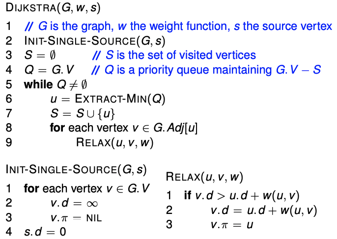
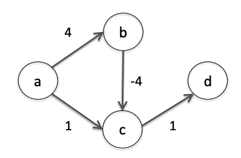
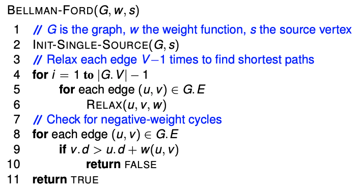
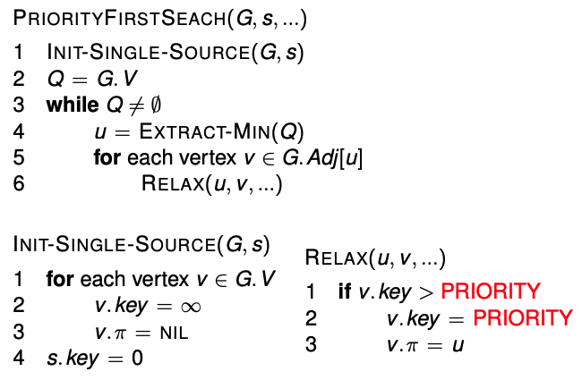

# Lecture 5 &mdash; Graph Algorithms 2

Recall the shortest path is a sequence of vertices from a particular start to a particular end. The total weight of the path is the sum of all edge paths.

There are several types:

- Single pair: the shortest path between two given vertexes $(u, v)$.
- Single source: Given a vertex $v$, find shortest paths to every other vertex.
- Single destination: Given a destination $v$, find shortest paths _from_ every other vertex.
- All pairs: Find the shortest path between every pair of vertices.

## Single source shortest path

Given a graph $G$ with weight function $w$ and source $s$, for each $v \in G.V$, we need to calculate

- $v.d$, its distance from $s$, and
- $v.\pi$, its predecessor from a shortest path from $s$ to $v$.

1. We initialise $s.d=0$ and $v.d=\infty$ else. The invariant here is that the shortest distance from $s$ to $v$ is less than or equal to $v.d$ less than or equal to $\infty$.
2. Initialise all $v.\pi = \textit{null}$.
3. Perform a relaxation on the distance estimates until we reach a solution.

### Relax

This checks if we can reach $v$ (from $s$) sooner by going through $u$. If so, we reduce the distance and update the predecessor.

```python
def relax(u, v, w):
  if v.d > u.d + w(u, v):
    v.d = u.d + w(u, v)
    v.pi = u
```

Note that this preserves the distance and predecessor invariants as this only changes if a better path is found.

## Non-negative weights

If $p_n = v_1 \to v_2 \to \cdots \to v_n$ is a shortest path from $v_1$ to $v_n$ in a graph with no negative weights, then for all $1 \le i \le n-1$, the prefix
$$
p_1 = v_1 \to \cdots \to v_i
$$
is in fact a shortest path from $v_1$ to $v_i$ and we must have $\operatorname{weight}(p_i) \le \operatorname{weight}(p_n)$. This does not hold if some edges have negative weights! There might be edges of negative weight between $p_i$ and $p_n$.

## Dijkstra's algorithm

Solves the single-source shortest paths problem for non-negative weighted graphs. A more sophisticated variant called A* is commonly used in computer games.

1. Initialise $s.d=0$ and $v.d=\infty$ otherwise. Distance invariant is the same.
2. Initialise $v.\pi=\textit{null}$. Predecessor invariant.
3. Visit each vertex in order of its distance from the source. For each outgoing edge, we relax along that edge.

This is a generalisation of breadth first search to weighted graphs.

How can we efficiently find the next vertex to visit? Let $S$ be the set of visited vertices. We will maintain $Q$, a priority queue of vertices $V-S$ keyed by $v.d$.

This runs in $O(E \lg V)$ with a binary heap or $O(E + V \lg V)$ for a Fibonacci heap.



### Intuition

When we visit a vertex, we know that we have found the shortest path to $u$. This means the predecessor $v$ of $u$ may have smaller distance, in which case we already visited it, or equal distance, in which case we have already found a shortest path to $u$ with the same length.

## Negative weights

What if we had negative weights? Dijkstra'a algorithm might not relax edges in the correct order. That is, $(u, v)$ might be relaxed before we have a shortest path to $u$ so this relaxation would be incorrect.

Is the shortest path even well-defined for graphs with negative weight cycles? No, because we can just keep going around that negative cycle to reduce the weight.

Here is an example without negative weight cycles where Dijkstra's algorithm fails. This goes in order $a, c, d, b$ which cannot find the correct shortest path.



There are two problems here: we need to avoid negative weight cycles, and we need to relax in the correct order.

## Bellman-Ford

After initialisation, we have found all shortest paths which contain $\le 0$ edges. After relaxing each edge once, we have found all shortest paths containing $\le 1$ edges. Relaxing all the edges again finds shortest paths of length $\le 2$. Continuing to $V-1$ times, we have all shortest paths containing $\le V-1$ edges.

The Bellman-Ford algorithm uses this to find single-source shortest paths on directed graphs which may contain negative weight edges. Additionally, it detects negative weight cycles and is able to return false if one is found.



If there is a negative weight cycle, then even going through $V-1$ times is not enough to reduce the shortest path length to minimum. This is because $V-1$ is the maximum length of a shortest path with no cycles. We go through the edges once more and if we find another decrease (i.e. another shortest path), we return false.

This algorithm has time complexity $O(V E)$, because it goes through the edges $V-1$ times. The worst-case of this is a fully connected graph where $E=V^2$.

This is a generalisation of Dijkstra's algorithm but runs in much slower time. Is there a more efficient way to find single-source shortest path if the graph is acyclic?

## Priority first search

This is a generalisation including **Dijkstra's algorithm** and **Prim's algorithm** for MST. 

Vertices are visited in order of _priority_ (for some definition of priority function). For example, the priority could be the weight (as in Prim's) or the cumulative distance (as in Dijkstra's).



