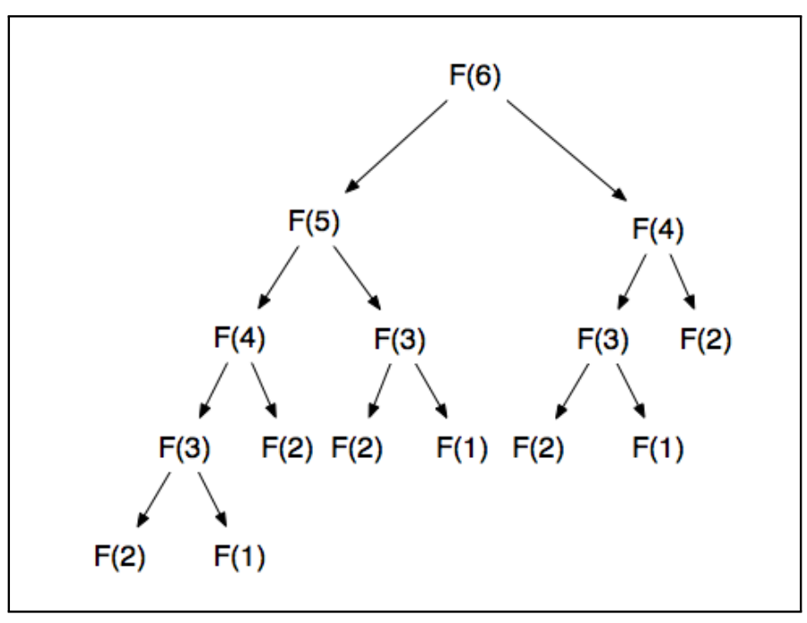
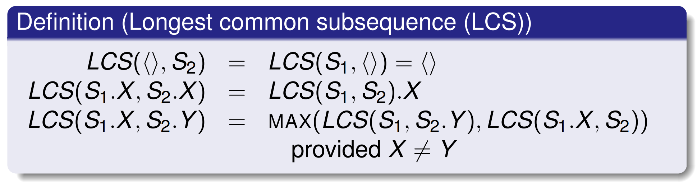
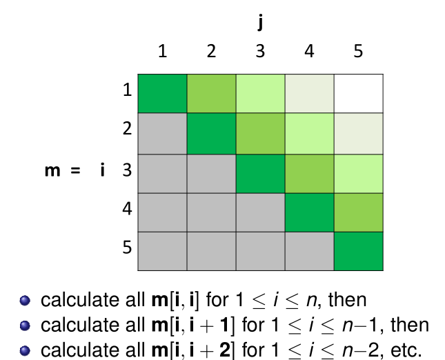
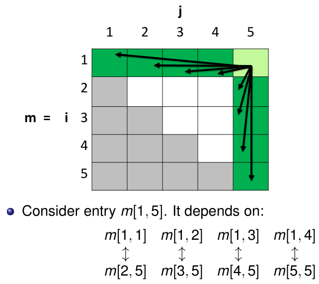

# Lecture 6 &mdash; Dynamic Programming

Dynamic programming is a method for efficiently solving problems with a certain structure. 

- Problems have **optimal substructure property** where an optimal solution can be expressed in terms of optimal solutions to subproblems.
- A naive recursive solution may be inefficient (exponential) due to repeated computation of subproblems.
- Dynamic programming avoids recomputation of subproblems by storing them.

Generally, this requires a deep understanding of the problem.

It can be constructed "**bottom-up**" which computes solutions to base-case subproblems first, then calculates larger subproblems until the goal can be computed. Massive speed improvements are possible, from exponential to polynomial time.

Another strategy is **memoisation** which is a top-down approach. It follows the same call stack as recursion and is often more 'elegant', but with worse constant factors than bottom-up.

## Fibonacci numbers

The most basic dynamic programming is
$$
F(i) =\begin{cases}
1 , &i = 1 \text{ or } i = 2,\\
F(i-1)+F(i-2), &\text{else}.
\end{cases}
$$
In terms of code,

```python
def fib(n):
    if n == 1 or n == 2:
        return 1
    return fib(n-1) + fib(n-2)
```

The corresponding recurrence is
$$
T(n) = T(n-1) + T(n-2) + \Theta(1) \in \Theta(1.6^n).
$$


Looking at the recursive tree, we see there is significant overlap of the base cases being recalculated. For example, $F(3)$ is calculated three times in the calculation of $F(6)$. The key idea is instead of recomputing these, we can store the calculations in an array and look it up later.

We can implement dynamic programming using arrays:

```python
def fib_dyn(n):
    T = [0] * n
    T[1] = 1
    T[2] = 1
    for i in range(3, n+1):
        T[i] = T[i-1] + T[i-2]
    return T[n]
```

The array stores the intermediate results and this obviously runs in time $\Theta(n)$.

Alternatively, we can implement this using memoisation with a global variable $T$.

```python
def fib_init(N):
    T = [None] * N
    T[1] = 1
    T[2] = 1
    
def fib_memo(n):
    if T[n] is None:
        T[n] = fib_memo(n-1) + fib_memo(n-2)
    return T[n]
```

## General principle

If

- the problem has the optimal substructure property, and
- its recursive solution has overlapping subproblems, then

a dynamic programming solution may apply. The benefit of this is we get a much more efficient solution at the loss of some elegance.

## Longest common subsequence

Suppose we have two strings and we want to find the longest (not necessarily contiguous) subsequence of characters shared between the two strings. For example,
$$
\begin{aligned}
S_1 &= \text{A B C B C} \\ 
S_2 &= \text{C A B B D}
\end{aligned}
$$
and here, $\operatorname*{LCS}(S_1, S_2) = \text{ABB}$. This has applications in gene sequencing, file `diff`, and more.

**Assume** we have already solved a smaller subproblem. First, we will develop a recursive description of LCS. 

Suppose we know the LCS of S1 = "ABCBC" and S2 = "CABBD". Then, what is the LCS of *S1.E* and *S2.E*? If we add the same character to both, then the LCS will be the same LCS but with E appended to the end, i.e. *LCS(S1, S2).E*. 

What if we added different letters? Note that LCS(S1.X, S2.Y) is _not necessarily_ LCS(S1, S2). We need to be careful if S2 already contains an X, for example. More formally, to calculate LCS(S1.X, S2.Y) where X is not Y we need to recursively look at both possibilities:
$$
\begin{aligned}
\operatorname*{LCS}(S_1.X, S_2.Y)=\max\{\operatorname*{LCS}(S_1.X, S_2),\ \operatorname*{LCS}(S_1, S_2.Y)\}
\end{aligned}
$$
under the assumption we already have the solutions to smaller subproblems.

The base case is if at least one of the argument strings is empty, the LCS is empty.

Below, we put it all together and return the length of the string instead of the string itself.



In pseudocode, this can be elegantly written as

```python
def lcs_length_rec(s1, s2, i, j):
    if i == 0 or j == 0:
        return 0
    if s1[i] == s2[j]:
        return 1 + lcs_length_rec(s1, s2, i-1, j-1)
    return max(lcs_length_rec(s1, s2, i-1, j), lcs_length_rec(s1, s2, i, j-1))
```

Unfortunately, this is $\Omega(2^{\min (n, m})$. We have solved an optimisation problem by finding optimal solutions to subproblems, so we can see it has the optimal substructure property.

We can rewrite this using bottom-up dynamic programming and a $n \times m$ integer array, because the recursive function has two arguments with $n$ and $m$ distinct values. Filling in this matrix from the smaller indices (i.e. smaller $i$ and $j$) to the larger indices will solve the problem, which runs in $\Theta(nm)$ time.

## Matrix chain multiplication

Recall that to compute $AB$ where $A$ is $p \times q$ and $B$ is $q \times r$, then this takes time $pqr$. Although 
$$
M_1(M_2\cdot M_3) = (M_1\cdot M_2)M_3,
$$
the grouping may have a significant impact on the number of operations needed.

Suppose we have a sequence of matrices $M_1, M_2, M_3, M_4$ and need to evaluate their product. Matrix multiplication is not commutative but it is associative. What association minimises the total cost of multiplying these matrices? Assume that dimensions of adjacent matrices are compatible.

Before we get started, how long would a naive solution take? How many ways are there of multiplying $n$ matrices together? Let this be $N$. Writing out a few terms,
$$
\begin{aligned}
N(1) &= N(2) =1\\
N(3) &= N(1) \times N(1)=2\\
N(4) &= N(1) \times N(3) + N(2) \times N(2) + N(3) \times N(1)=5
\end{aligned}
$$
In general, 
$$
N(n) = \sum_{i=1}^{n-1}N(i) \times N(n-i).
$$
This is tricky, but to get a lower bound, we have $N(1) = 1$ so
$$
\begin{aligned}
N(n) \ge N(1) \times N(n-1) + N(n-1)\times N(1) = 2N(n-1)\in \Omega(2^n).
\end{aligned}
$$
This is not great, can we find a dynamic programming solution? First we need to express it as a recursive problem, then identify overlapping subproblems.

### Dynamic programming

**Subproblems**: Let $C_{ij}$ be the minimum cost of multiplying the matrices between $i$ and $j$, i.e. $M_1 M_{i+1}\ldots M_j$. The solution is given by $C_1,n$.

**Base cases:** $C_{ii}=0$ for all $i$ because no operations are needed with a single matrix.

**Recursive case:** To compute $C_{ij}$, we can split the matrices $i$ to $j$ into different groupings, with lengths $a$ and $b$ with $a, b \ge 1$ and $a+b = j-i+1$. We take the minimum of the recursive cost of each of these groupings added with the upfront cost of multiplying the two resultant matrices.

Specifically,
$$
C_{ij} = \min \{\ C_{i,i+k} + C_{i+k+1,j} + p_{i-1}p_{k+1}p_{j} : k \in 1, \ldots, j-i+1\ \}.
$$
This can be made slightly nicer by using $i \le k < j$. This is incredibly inefficient to compute directly (even worse than our lower bound above), but is the intuition we need.

A key insight here is that $C_{ij}$ depends on $C_{ij}$ and $C_{k+1,j}$. We can draw a matrix of $C$ and fill it _bottom-up_ starting with the diagonals, corresponding to $C_{ii}=0$. This gives us $\Theta(n^3)$ runtime.





