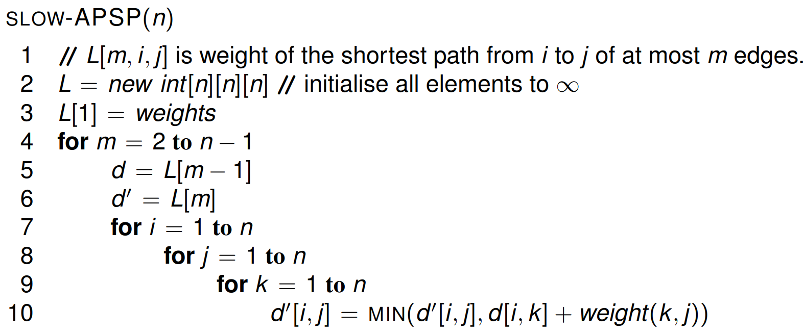
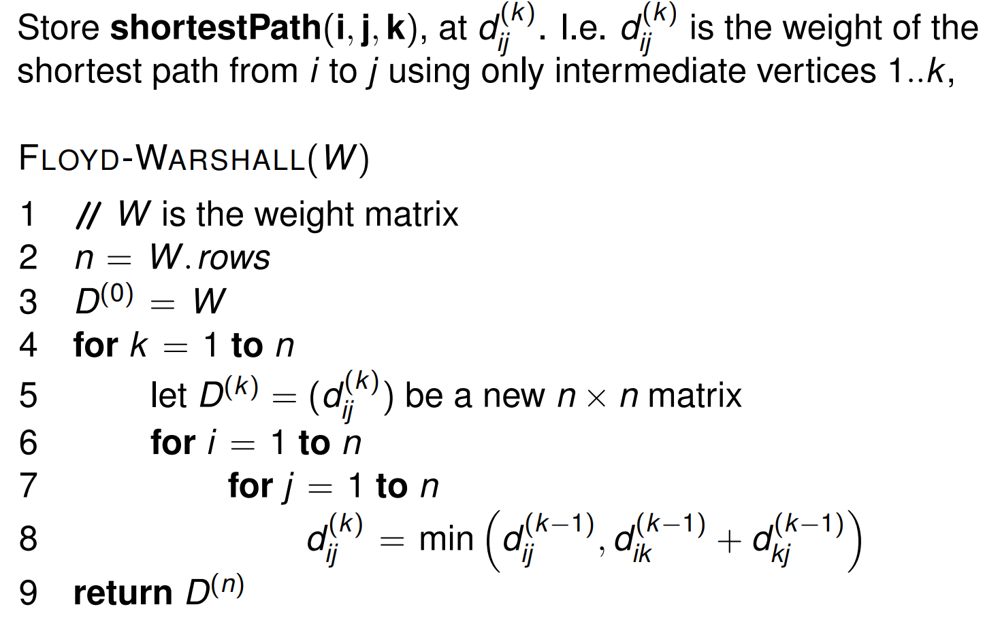
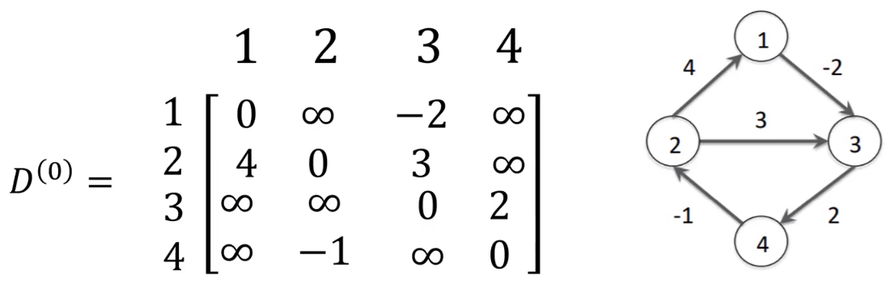
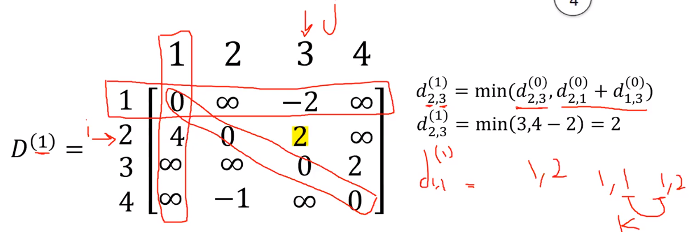
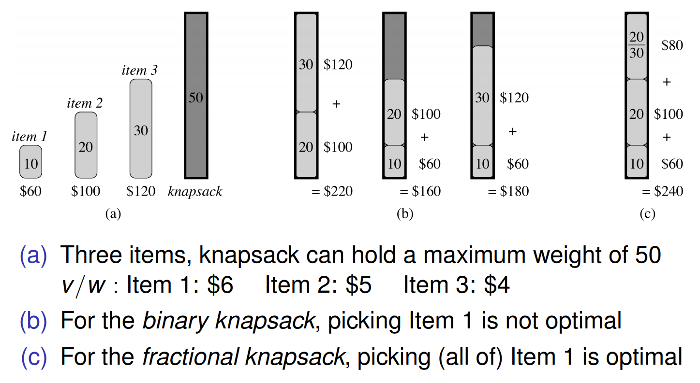

# Lecture 7 &mdash; Dynamic Programming 2

## All-pairs shortest paths

We want to find the shortest path between all pairs of nodes in a graph. Doing this naivlely with Dijkstra's algorithm from each node is $V$ times of $O(E + V \log V)$ which is $O(V^3)$. If we wanted to handle negative weights as well, we need to use Bellman-Ford which is $V$ times of $O(V^3)$, so $O(V^4)$. 

We can do better by solving APSP including negative weights in $O(V^3)$ using something called Floyd-Warshall.

## Recursive formulation

Suppose there are $N$ vertices numbered $1, \ldots, N$ and the graph is represented as an adjacency matrix where the weight from a vertex to itself is 0 and no edge is infinity.

Recursively defining this problem, a path from $i$ to $j$ is either:

- an empty path if $i = j$ of $\langle i \rangle$, or
- a path with more than one edge which is made up of a path $p$ from $i$ to some $k$ and an edge $(k, j)$. 

The weight of this path in total is $\operatorname*{weight}(p) + \operatorname*{weight}(k, j)$. The key insight is that if the shortest path $\langle i, \ldots, k, j \rangle$ has $m$ edges, then the path from $i$ to $k$ has at most $m-1$ edges and it is a _shortest_ path from $i$ to $k$.

Defining this recursively, let $\operatorname*{shortestPath}(i, j)^m$ or $s(i, j)^m$ be the weight of the shortest path from $i$ to $j$ using at most $m$ edges. As a result,

- $s(i, j)^0$ is 0 if $i=j$ or $\infty$ otherwise, and
- $s(i, j)^m = \min_{k \in V} (s(i, k)^{m-1}+w(k, j))$.

Therefore, $s(i, j)^1$ is just the weight from $i$ to $j$. We can use a _three-dimensional_ array for the three arguments. This matrix will have dimensions $n \times n \times n$. The pseudocode below would run in time $\Theta(n^4)$.

In fact, we don't need to calculate for all $m$. As a slight improvement, we can double $m$ at each step while still solving the problem. This gives us an asymptotic tight bound of $\Theta(n^3 \log n)$.

## Floyd-Warshall

Why did we define our subproblems in terms of path length? What if we defined it in terms of which intermediate nodes were in the path?

Let $s(i,j,k)$ be the weight of the shortest path from $i$ to $j$ using intermediate vertices $1, \ldots, k$.  Then, to extend $k$ to $k+1$, we just need to consider if the path from $i$ to $j$  via $k+1$ is shorter than the previous shortest path. Specifically,
$$
\begin{aligned}
s(i, j, 0) &= w(i, j) \\ 
s(i, j, k+1) &= \min \{s(i, j, k),\ s(i, k+1, k) + s(k+1, j,k)\}.
\end{aligned}
$$
This removes the need to minimise over $V$, significantly speeding up the algorithm. The code below runs in $\Theta(n^3)$ where $n$ is the number of vertices.

The base case is $D^{(0)}$ which is just the weights of the graph.

Note that when filling in the matrix $D^{(1)}$, the 1 column and row stays constant because these are paths ending or starting at $1$ and the shortest path will not contain $1$ as an intermediate vertex.

To fill in the $i,j$-th cell of $D^{(1)}$, use the minimum of $D^{(0)}_{ij}$ and $D^{(0)}_{i1}+D^{(0)}_{1j}$, i.e. the path through node $1$.

## Johnson's algorithm

This is $\Theta(V^3)$ worst case but for sparse graphs, it can be $O(V^2 \log V)$ using an adjacency list representation. The strategy is

- reweight to eliminate negative weight edges,
- add a new "source" vertex, then
- run Dijkstra's algorithm from each node.

This has relatively high overheads (constant factors).

## DP vs greedy algorithms

A dynamic programming solution usually applies to optimisation problems with optimal substructure property and overlapping subproblems.

Some optimisation problems with optimal substructure have the **greedy-choice property**. That is, given a larger problem, we know which subproblem will lead to the optimal solution without explicitly computing all the subproblems. To solve the problem, we can make a greedy (locally optimal) choice.

This is more efficient by making a greedy choice and solving only the chosen subproblem. If applicable, this can significantly reduce the runtime from dynamic programming because there are much fewer subproblems to solve.

### Examples of greedy algorithms

For example, Prim's algorithm works by selecting the minimum weight edge leaving the tree. Selecting the minimum weight edge is a greedy choice. 

Similarly, Kruskal's minimum spanning tree algorithm is a greedy algorithm by selecting the minimum weight edge which does not create a cycle.

Dijkstra's algorithm is also a greedy algorithm by selecting the vertex with minimum distance from the priority queue.

## Activity selection

Suppose we have a list of activities of the form (start, finish) and we want to choose a combination of these which are not overlapping and maximise the number of activities.

Process: 

1. Sort by finishing time in $\Theta(n \log n)$.
2. Add a compatible activity to the set, starting with the activity finishing first.

This is possible because we surely want to choose the activity which finishes earliest to maximise possibilities at later points in time, regardless of the start time. We do not care to maximise time spent doing activities, only the number of activities done.

The loop is $\Theta(n)$ so the initial sort dominates the runtime with $\Theta(n \log n)$.

## Knapsack problem

Suppose we have a set of items each with a value $v$ and weight $w$ and we need to fill a knapsack while maximising the value such that the total weight is no more than $W$.

Here are two variants:

- fractional knapsack where we can take fractions of items, and
- binary knapsack where we can only take all or none of a particular item.

In *fractional knapsack*, the greedy choice is just to fill the knapsack with the item which has the highest value to weight ratio. This does not work for binary knapsack.

