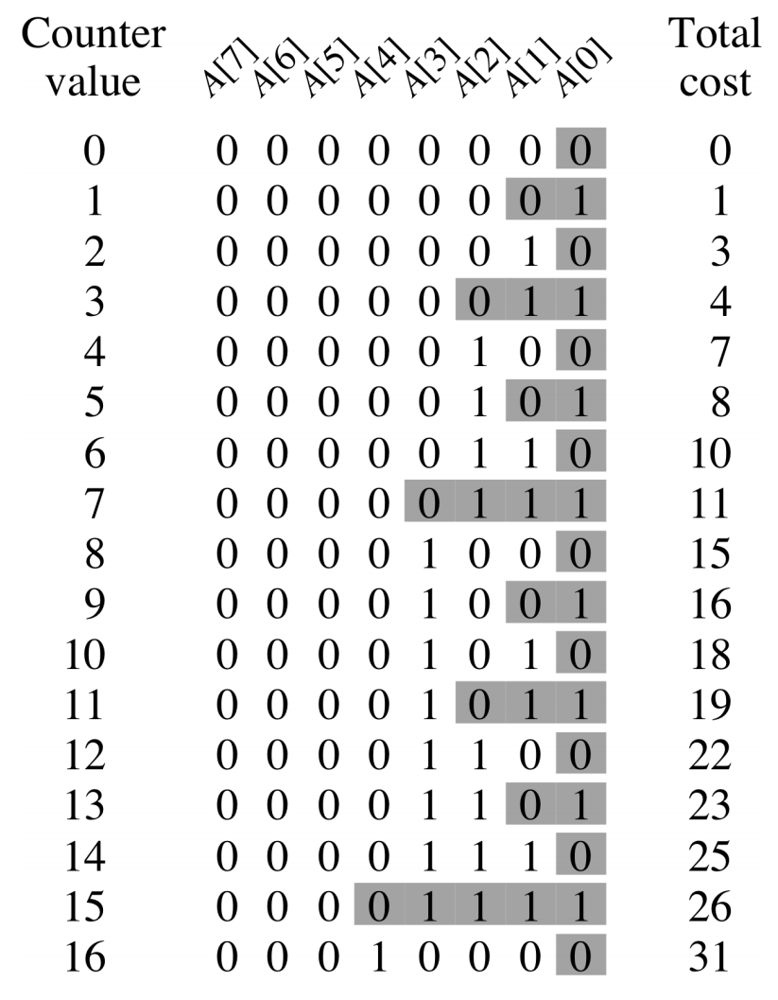

# Lecture 8 &mdash; Amortised Analysis

## Amortised analysis

We've analysed algorithms "one-off". However, we often use data structures and call their methods many times. Using different data structures can impact the running time of the algorithm.

Amortised analysis is essentially looking at the average complexity or time used for a *series* of operations. It has origins from financial contexts, for example a mortgage's cost is split across a much longer time period.

Using naive analysis of a sequence of operations might assume the worst case all the time. In practice, the worst case may be very rare. Amortised analysis considers sequences of operations, typically those modifying a data structure.

Some examples include Java's ArrayList, ArrayDeque, and C++'s vector which have operations running in *amortised constant time*.

### Dynamic table

The most simple example is a dynamic table, which is capable of storing an unknown number of items by doubling its capacity when it is full. Typically, inserting is constant-time but sometimes a reallocation and copy is needed.

The best-case is $\Theta(1)$ and worst-case is $\Theta(n)$ if resizing is necessary. To insert $n$ elements, the worst case would be $\Theta(n^2)$? However, it is clear the _most_ of the operations would be $\Theta(1)$.

Formally, we are analysing

```python
for i in range(n):
    insert(e[i])
```

for some sequence of items $e$. The vast majority of the operations are constant-time, but how many are not? This will depend on $i$.

As a more precise analysis, we can let $c_i$ be the cost of the $i$-th insertion which will be 1 most of the time but $i$ if $i-1$ was an exact power of 2.

| $i$   | 1    | 2    | 3    | 4    | 5    |
| ----- | ---- | ---- | ---- | ---- | ---- |
| size  | 1    | 2    | 4    | 4    | 8    |
| $c_i$ | 1    | 2    | 3    | 1    | 5    |

This is the **aggregate method** for amortised analysis. The cost of $n$ insertions is
$$
\begin{aligned}
\sum_{i=1}^n c_i \le n + \sum_{j=1}^{\lceil \lg n \rceil}2^{j-1} \le 3n = \Theta(n)
\end{aligned}
$$
The average cost of each insert operation is $\Theta(n) / n = \Theta(1)$. What if we start mixing insert and delete operations? In that case, we can no longer use this summation because the cost will be different depending on the order of inserts and deletes.

## Stack

Consider a stack with two operations: push and pop. Suppose we add a multipop operation:

```python
def multipop(S, k):
    while S and k > 0:
        pop(S)
        k = k - 1
```

The multipop operation can be $O(n)$ if $n=k$. Clearly, any sequence of $n$ stack operations must be $O(n^2)$. However, we can get a better bound.

We can use some details here: 

- multipop only iterates while the stack is not empty, and
- each element is pushed and popped exactly once.

We are interested in analysing a sequence of $n$ mixed operations:

```python
for i in range(n):
    push(...) or pop(...) or multipop(...)
```

Two methods we could use here are:

- the accounting method, which focuses on the operations, or
- the potential method, which focuses on the data structure.

### Accounting method

Consider the actual cost $c_i$ of each operation. This is 1 for push/pop and $\min(\operatorname*{size}(S), k)$ for multipop. We can assign an *amortised cost* $\hat c_i$ for each method as 2 for push and 0 for the others. Here, we add the cost of the eventual pop upfront in the push method, using the rule that an item is pushed then popped exactly once. Then, the cost of the pop is already "paid" in the pop so "cost" nothing.

For any sequence of operations, the amortised cost must be an upper bound on the actual cost. We can use this in place of the complicated actual cost and say that a sequence of $n$ operations has amortised time $O(n)$.

To prove this, we must show that running total of the amortised costs is greater than or running total of the sum of the actual costs. That is, for all sequences and $n$,
$$
\sum_{i=1}^n \hat c_i \ge \sum_{i=1}^n c_i
$$
Intuitively, the extra "credit" in the push pays for any later (multi)pop. 

### Potential method

This is a third method we can use. It finds a **potential function** on the data structure. The amortised cost is the actual cost plus change in potential. We write this as
$$
\hat c_i = c_i + \Phi(D_i) - \Phi(D_{i-1}).
$$
As before, the amortised cost must be an upper bound on the actual cost. Thus,
$$
\sum_{i=1}^n \hat c_i = \sum_{i=1}^n (c_i + \Phi(D_i)-\Phi(D_{i-1})) = \sum_{i=1}^n c_i + \Phi(D_n) - \Phi(D_0).
$$
We need to show that $\Phi(D_i) \ge \Phi(D_0)$ for all $i$. This can be trivially satisfied if $\Phi(D_0)=0$ and $\Phi(D_i) \ge 0$.

Returning to our stack, the actual costs are $1$, $1$, and $k'$. Define $\Phi(S)$ as the number of elements in the stack and the change in potential is $1$ for push, $-1$ for pop, and $-k'$ for multipop.

The amortised cost is the actual cost added to the change in potential, giving us push is 2, pop is 0, and multipop is 0. Of course, $\Phi(D_0)=0$ because the stack starts out empty so the requirement is trivially satisfied. Thus, all stack operations have constant amortised time.

Here, this resulted in the same amortised costs as the accounting method.

## Binary counter

Suppose we have a counter which counts by 1 in binary, from 0 to 1 to 10 and so on. The total cost is the number of bits flipped.

This works by flipping all the rightmost 1 bits to 0, then set a 1 in the next place.

```python
def increment(A, k):
    i = 0
    while i < k and A[i] == 1:
        A[i] = 0
        i = i + 1
    if i < k:
        A[i] = 1
```

The worst case is if we have a chain of ones and this will take time $n$, the length of $A$. Doing $n$ increments would be $n^2$ then? Of course not!

Let's see how we can think of this.

### Aggregate method

We want to count the number of flips. After $n$ increments, the number of times bit $i$ is flipped is $\lfloor n/2^i \rfloor$. Bit 0 flips every time, 1 flips every second time, 2 flips every 4th increment, and so on.



Hence, the total cost is 
$$
\sum_{i=0}^{k-1}\left\lfloor\frac n {2^i}\right\rfloor \le 
\sum_{i=0}^{k-1}\frac n {2^i} < n \sum_{i=0}^\infty \frac 1 {2^i} = 2n \in O(n).
$$
The aggregate method is writing the actual cost using a summation.

### Accounting method

The actual cost is the number of low-order 1s plus one for the final flip of 0 to 1.

To determine the amortised cost, let each flip from 0 to 1 have amortised cost of 2 and let each flip from 1 to 0 have cost 0. The amortised cost of increment is then 2.

We must show this is an upper bound on the actual cost. Flips from 1 to 0 must occur after that flip has already been flipped and hence paid for.

## Array resizing

We return to this using the accounting method.

### Accounting method

The actual cost is as before. We can charge a cost of 3 for the $i$-th insertion which is made up of 1 for the insert, and 2 for later doubling (1 for copying itself and 1 for copying an older element). We need to account for old elements because their credit would already have been used in the previous doubling, so we only have spare money from the most recent half.

This is essentially manually applying the cost upfront at each operation.

The invariant is that the "bank balance" never drops below zero. This is the same as the sum of amortised costs being an upper bound for sum of actual costs.

## Potential method

We need to determine a potential function. Here, this can be $\Phi(D_i)=2i - 2^{\lceil \log i \rceil}$. Assume that $2^{\lceil \log 0 \rceil}=0$ which trivially satisfies $\Phi(D_0)=0$ and $\Phi(D_i) \ge 0$. This is essentially the same as a "bank balance" from before.

The amortised cost of the $i$-th insertion is
$$
\begin{aligned}
\hat c_i &= c_i - \Phi(D_i)-\Phi(D_{i-1})  \\ 
&= \begin{cases}
i, & i-1\text{ is a power of 2}, \\ 
1, &\text{else},
\end{cases}
+(2i-2^{\lceil \log i\rceil })
-(2(i-1)-2^{\lceil \log (i-1)\rceil })
\end{aligned}
$$
Looking at each case, if $i-1$ is an exact power of $2$,
$$
\begin{aligned}
\hat c_i &= i+2 - 2^{\lceil \log i \rceil} + 2^{\lceil \log (i-1)\rceil} \\ 
&= i+2 - 2(i-1) + (i-1) \\ 
&= 3
\end{aligned}
$$
If $i-1$ is not an exact power of 2, the ceiling makes the power the same and so
$$
\hat c_i=3.
$$
Therefore, $n$ inserts take $\Theta(n)$ amortised time in the worst case.