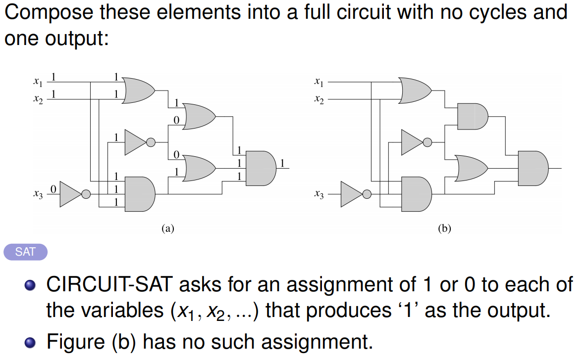
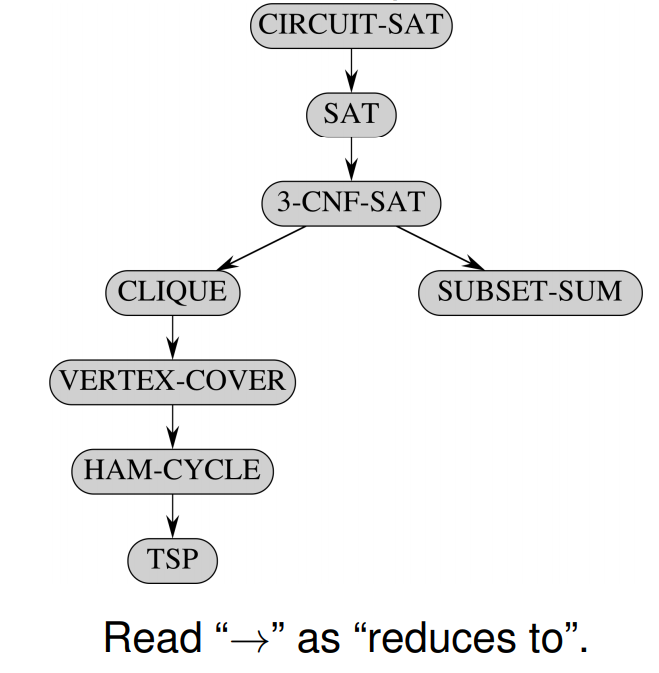
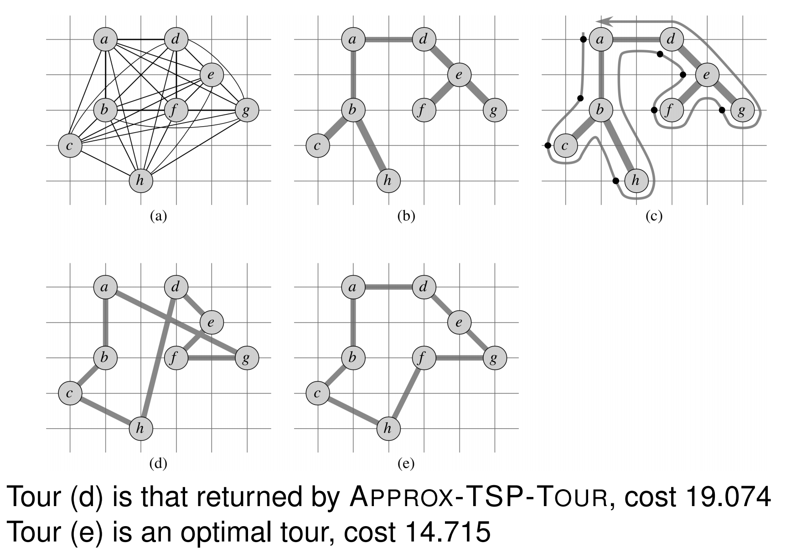

# Lecture 9 &mdash; Computational Complexity

## Polynomial time

We call polynomial time algorithms **tractable**. In practice, large polynomial algorithms are not tractable. However, if an algorithm has a polynomial-time solution, there is usually an _efficient_ polynomial-time solution.

For example, matrix multiplication has been improved from $\Theta(N^3)$ to something less.

The class of problems solvable in polynomial time on a serial random-access machine (which we have been using) is the same as 

- the polynomial-time problems on an abstract Turing machine, and
- the polynomial-time problems on a parallel computer when number of processors grows polynomially with input size.

So the computational model we use to execute our algorithm is largely irrelevant for the analysis.

Polynomials are **closed** under addition, multiplication, and composition. Thus, if the output of a polynomial-time algorithm is used as input for another polynomial-time algorithm, the resultant algorithm is also polynomial-time.

## Examples

Which problems have polynomial-time algorithms? Problems which look similar (in nature) may not be. 

We can find shortest paths from a single source in a directed graph in $O(VE)$ time, however the _longest_ simple path between two vertices is difficult. Even determining if a simple path exists with at least a given number of vertices is difficult (NP-complete).

An Euler tour in a connected directed graph is a cycle in which each edge of the graph is traversed exactly once. Finding an Euler tour can be done in $O(E)$ time. A Hamiltonian cycle in a graph is a simple cycle which contains all vertices in a graph. Determining _whether_ a graph has a Hamiltonian cycle is NP-complete.

### 2-CNF vs 3-CNF satisfiability

A boolean formula like
$$
(x_1 \vee \neg x_2) \wedge (\neg x_1 \vee x_3) \wedge (\neg x_2 \vee \neg x_3)
$$
may have a satisfying assignment of $x_1, x_2, x_3$ such that it evaluates to 1. The formula above does, e.g. 1 0 1.

A boolean formula is in conjunctive normal form (CNF) if it is a conjunction (and) of clauses, each of which is a disjunction )or) of literals, where a literal is a variable or a negation. Any boolean formula can be converted to CNF.

A $k$-CNF formula is one where each disjunction (or) has exactly $k$ literals. The example above is 2-CNF. Determining whether a 3-CNF is satisfiable is NP-complete.

## Background

Which problems have polynomial-time algorithms?

In complexity theory, we study _classes_ of problems (not algorithms themselves). We study **decision problems** (those with a yes or no) rather than optimisation problems. We will focus on concrete problems rather than abstract problems.

Optimisation problems usually have closely related decision problems. If the optimisation problem is "easy", the decision problem is also "easy". If the optimisation problem is "hard", the decision problem is also "hard".

### Example

A shortest path problem is an optimisation problem. We can can convert "find the shortest path from $u$ to $v$" to "is there a path from $u$ to $v$ with at most $k$ edges"?

If we can solve the optimisation problem, we can just take the length of the path and return 1 or 0 depending on whether the path's length exceeds $k$. Shortest path optimisation is solvable in polynomial-time and so the shortest path decision problem is solvable in polynomial-time.

### Definitions

**Definition.** An **abstract problem** is a binary relation on a set $I$ of problem instances and a set $S$ of problem solutions. Note there may be multiple solutions for a given instance.

**Definition.** An **abstract decision problem** is a function from an instance set $I$ to the solution set $\{0,1\}$. Any given instance has a unique 0 or 1 solution.

### Encodings

We need to represent problem instances in a some way a computer can understand. 

**Definition.** An **encoding** of a set $S$ of abstract objects is a mapping from $S$ to the set of binary strings $\{0,1\}^*$. For example, we can encode a natural number in its binary representation. More complicated objects can be represented as a binary string of its components.

**Definition.** A **concrete problem** is a problem whose instance set is the set of binary strings $\{0,1\}^*$.

**Definition.** An algorithm **solves** a concrete problem in time $O(T(n))$ if, given an instance $i$ of length $n=|i|$, the algorithm can produce a solution in $O(T(n))$ time.

**Definition.** A concrete problem is **polynomial-time solvable** if there exists an algorithm to solve it in $O(n^k)$ time for some constant $k$. Here, $n$ is the size of the input.

**Definition.** The **complexity class *P*** is the set of *concrete decision problems* which are *polynomial-time solvable*.

An abstract decision problem $Q$ maps an instance $i$ to 0 or 1: $Q \in I \to \{0,1\}$. An encoding makes abstract problems concrete. Given $e : I \to \{0,1\}^*$, we can map an abstract problem to a concrete problem with
$$
e(Q) \in \{0,1\}* \to \{0,1\}.
$$
And we can solve an abstract instance $i$ with
$$
e(Q)(e(i)) = Q(i).
$$
Some binary strings may not map to an instance. We just assume such invalid strings map to $0$.

Ideally, the complexity would be independent of encoding but this is not the case. 

As an example, suppose we take an integer $k$ as the sole input to an algorithm and it has running time $\Theta(k)$. If we encode it as binary number, the size of the input is $n=\lfloor \log k \rfloor + 1$ and the complexity of the resulting algorithm is $\Theta(k) = \Theta(2^n)$. If we instead use a unary representation, the size of the input is $n=k$ and the complexity is $\Theta(n)$.

In practice, we want to rule out expensive encodings like unary.

We assume a **standard encoding** where the encoding of an integer is polynomially related to its binary encoding, the encoding of a finite set is polynomially related to its encoding as a list of its elements enclosed in braces and separated by commas (as binary bytes). The notation $\langle G \rangle$ is the standard encoding of $G$.

**Definition.** A **polynomial-time computable function** is a function $f : \{0,1\}^* \to \{0,1\}^*$ if there exists a polynomial-time algorithm $A$ that given any $x \in \{0,1\}^*$ produces $f(x)$.

### Reductions

**Definition.** A **polynomial-time reduction _F_** is a polynomial-time algorithm which reduces an instance $\alpha$ of a problem $A$ to an instance $\beta$ of the problem $B$. Then, if $\beta=F(\alpha)$ then $A(\alpha)=B(\beta)$ for all $\alpha$. Therefore, if $B$ is easy, then $A$ is easy as well.

We can use reductions to show how hard a problem is. Suppose we know that no polynomial-time algorithm algorithm exists to solve $A$ and we can reduce $A$ to $B$ in polynomial time. As a result of this, $B$ cannot have a polynomial time algorithm. If $A$ is hard, $B$ is hard as well.

To determine if a problem $A$ is in _P_, we can come up with a polynomial-time algorithm for $A$ or reduce $A$ to $B$ in polynomial-time where $B$ is a polynomial-time solvable problem.

## Nondeterministic polynomial (NP)

**Definition**. The **complexity class _NP_** is the set of concrete decision problems for which a solution can be verified in polynomial time. The naming comes because if you could somehow nondeterministically choose the correct solution, we would be able to solve it in polynomial-time.

Problems which we can't even verify a solution in polynomial time are unlikely to have a polynomial-time (efficient) algorithm to solve it.

_P_ is trivially a subset of _NP_, because if we can solve a problem we can just compute and compare solutions. The question is this: are there some problems where a solution is quick to verify but _can't_ be implemented efficiently? Most people believe there are (so $P \ne NP$), but we cannot prove it yet.

This is the famous **P = NP** problem. There is a $1,000,000 prize if you can prove or disprove this statement.

Many problems are in NP but we do not know whether they are in P.

### Travelling salesman problem

The TSP is to find the shortest (weighted) path which visits each vertex exactly once and returns where it starts. We will deal with the related decision problem which is "is there a tour of weight at most $k$?". A solution is a list of vertices in the order visited.

This decision problem can be verified by checking $S$ contains every vertex, adjacent vertices are connected, and the sum of weights is at most $k$. This can all be done in polynomial time.

Therefore, $\text{TSP} \in \textit{NP}$, but we do not know if this is in $P$. This is despite TSP being of practical commercial importance and decades of research.

## NP-Hard

**Definition.** A concrete decision problem $B$ is **NP-hard** if *every* problem $\textit{A} \in \textit{NP}$ is polynomial-time reducible to $B$.

Thus, if we can solve just one one NP-hard problem, then we can solve _all_ NP problems in polynomial time and P = NP.

## NP-Complete

**Definition.** A concrete decision problem $B$ is **NP-complete** if and only if it is *NP-hard* and it is in *NP*. These are the _hardest_ problems in NP.

Are there even any NP-complete problems? In fact, TSP is in NPC so every other problem in NP can be reduced to TSP in polynomial time.

The fact that NPC is non-empty is towards proving P = NP, but it is unlikely that this is the case. If we can show that a problem is NPC, it is reasonable to stop looking for an efficient algorithm (otherwise we would've shown P = NP).

### Circuit-SAT

The first NPC problem proven via Cook's theorem: "the circuit-SAT problem is NP-complete".

A circuit is a logical circuit of AND/OR gates, etc. Cook showed that _any_ problem in NP can be reduced to circuit-SAT in polynomial-time. Thus, if we can solve circuit-SAT in polynomial-time, we can solve anything in NP in polynomial-time.

The problem is does there exist an assignment of inputs which produces a 1 as output.



The proof is difficult and it involves encoding problem instances as binary strings, but this is a very useful result.

Proving that other problems are NPC is then easy. Let $X$ be an arbitrary problem. If circuit-SAT is polynomial-time reducible to $X$, then $X$ is NP-hard. 

This is because if we can solve $X$ in polynomial-time, then we can solve circuit-SAT and hence any NP problem in polynomial-time.

To show a problem is in NPC, we will also need to show $X$ is in NP.

### Reductions

The graph below shows transitive polynomial-time reductions. Alternatively, read the arrow as "can be implemented using". Therefore, circuit-SAT is no harder than SAT and so on, so since circuit-SAT is NP-hard, SAT is NP-hard.



Reducing circuit-SAT to SAT is done by writing the output of each gate as an intermediate variable as below. This can be done in polynomial time by doing constant work per gate.

Reducing SAT to 3-CNF-SAT is possible because every boolean formula can be polynomially reduced to 3-CNF.

We can reduce 3-CNF-SAT to CLIQUE can be done by drawing a graph where the vertices are the literals (variables or their negation). An edge exists between vertices if those variables are *compatible*. If there exists a clique of size $k$, then there exists an assignment of variables for 3-CNF with $k$ clauses.

CLIQUE can be reduced to VERTEX-COVER since they are dual problems. If we take the complement graph (same vertices, opposite edges), then a cover is just the clique of the graph complement. A cover is a minimum set of vertices which touch every edge.

VERTEX-COVER can be reduced to HAM-CYCLE but the graph is hideous.

We can reduce HAM-CYCLE to TSP. Now, we don't want just any path which visits all vertices but we want the least cost one. We can just add weights to each edge and solve TSP where $k$ is the one minus the number of edges. Similarly, we can assign an edge which exists a weight 0 and a non-existent edge weight 1, then look for a tour with weight 0.

## Overview

The classes of problems:

- _P_ is polynomial time solvable.
- _NP_ is polynomial time verifiable.
- _NP-hard_ if all problems in NP can be polynomial-time reducible to the NP-hard problem.
- _NPC_ is NP-hard and NP.

$$
\textit{P} \subseteq \textit{NP}, \quad \textit{NPC} \subseteq \textit{NP},\quad \textit{P}\overset?=\textit{NP}.
$$

If we can reduce an NP-hard problem to a problem X, then X must also be NP-hard.

## Approximations

### Approximate TSP

If our TSP graph satisfies the *triangle quality*, for all $u,v,w$, the cost of going directly between vertices is no more than an indirect path,
$$
c(u,w) \le c(u,v) + c(v,w),
$$
then we can approximate it using the minimum spanning tree. This will return a tour of no more than twice the cost of the optimal tour.

```python
def approx_tsp_tour(G,c):
    r = next(G.V)         # choose a random root vertex
    T = mst_prim(G, c, r) # run prim's algorithm to find MST
    L = preorder(T)       # preorder walk of T
    return L              # hamiltonian cycle which visits in order L
```

Firstly, if we weren't worried about repeating vertices, we could just walk along the MST tree. This would be the minimum cost of joining all the vertices. To make it a tour, we visit the vertices in the order of a preorder traversal. Due to the triangle inequality, this gives us the bound on the approximation cost.

